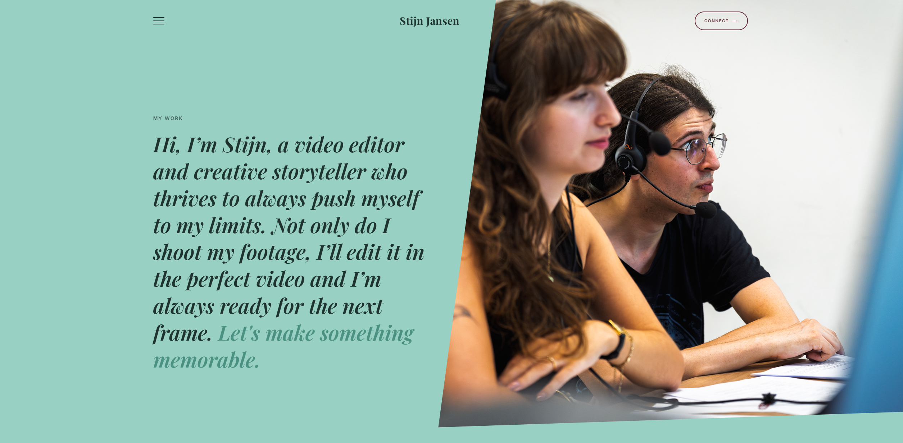
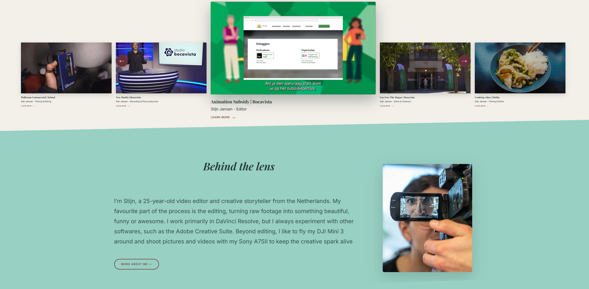
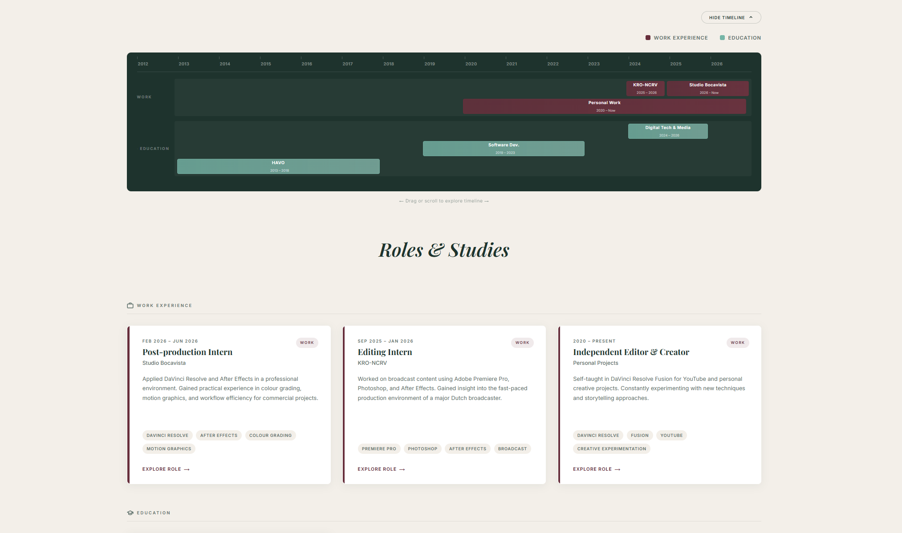
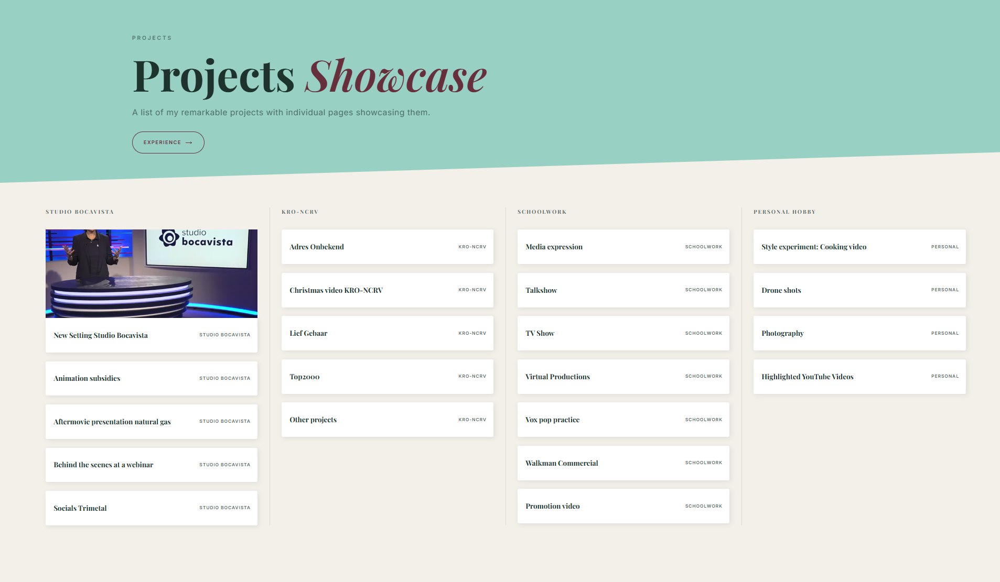
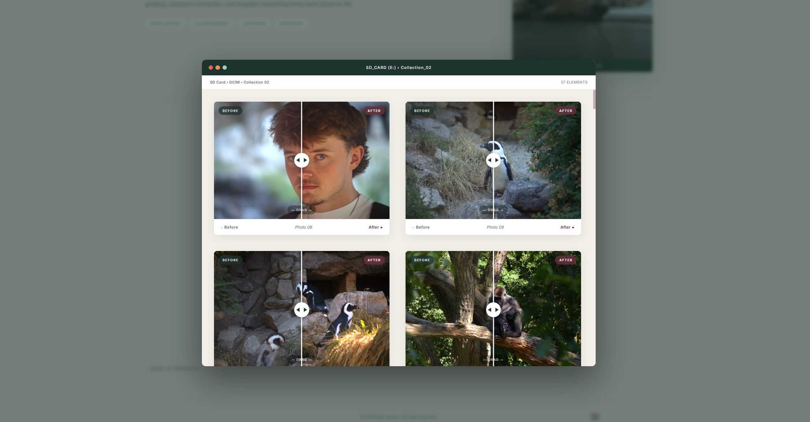
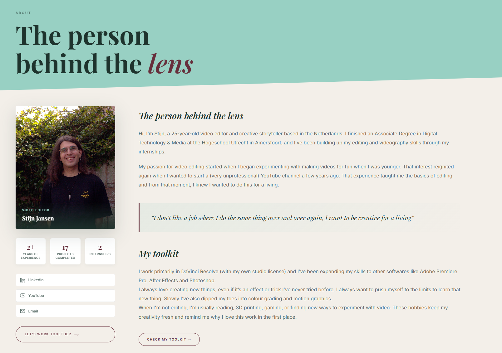

<h1 align="center">Portafolios digital</h1>

Un portafolios dedicado para una clienta que trabaja como videógrafa y camarógrafa

<h2>📌 Descripción del proyecto</h2>

Un extenso portafolios con multitud de páginas que explican en detalle cada proyecto en el que mi clienta ha trabajado, sus datos, su equipo, su experiencia, estudios y otras facultades de cara a conseguir empleo dentro de su campo.

La página actualmente esta online y siendo utilizada por mi clienta para buscar nuevas oportunidades laborales: <a href="https://thatoneportfolio.com/Dutch/MainPages/index-nl.html" target="_blank">Portafolios</a>

---

<h2>🛠️ Características principales</h2>

<ul>
  <li>HTML, CSS y JavaScript</li>
  <li>Diseño moderno e interactivo</li>
  <li>Multilenguaje</li>
</ul>

---

<h2>🖥️ Capturas de la aplicación</h2>

<h3>Landing page</h3>

<h3>Página principal</h3>

<h3>Página de experiencia y estudios</h3>

<h3>Página de proyectos</h3>

<h3>Fotografía</h3>

<h3>Contacto</h3>

---

<h2>🚀 Tecnologías utilizadas</h2>

<ul>
  <li>HTML</li>
  <li>CSS</li>
  <li>JavaScript</li>
  <li>Bootstrap</li>
</ul>
